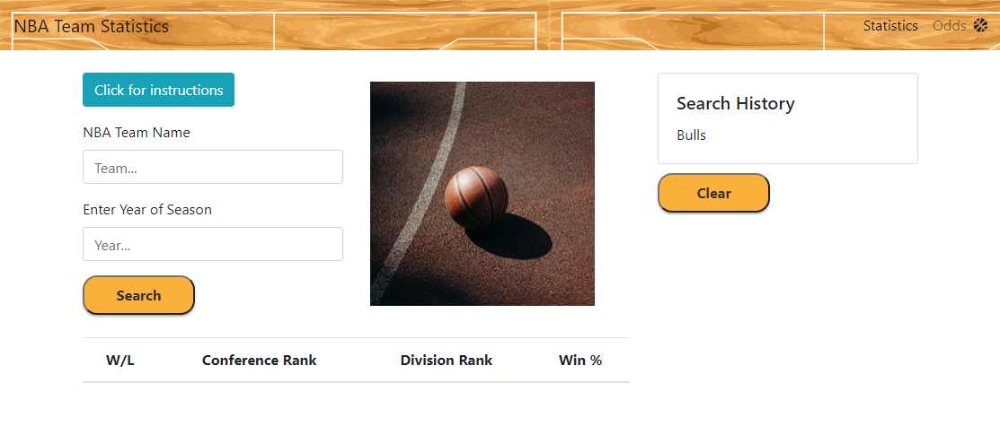
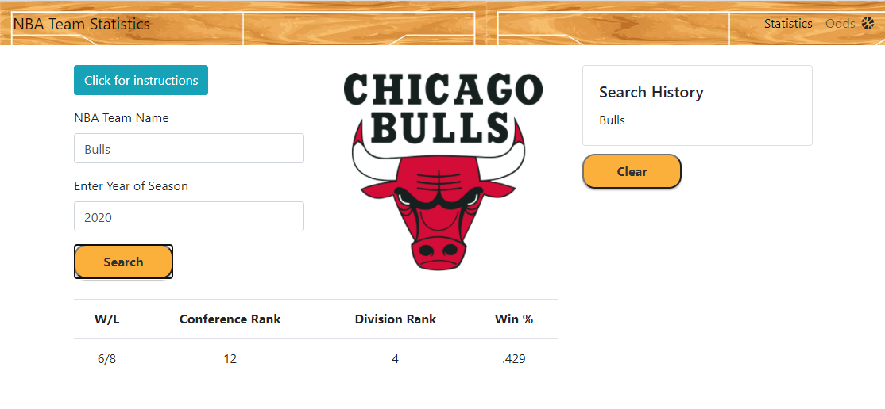

# NBA Odds and Statistics

This [website](https://codragon2020.github.io/odds_and_statistics/) was developed to allow NBA fans the ability to lookup their favorite team's stats and see what the odds are they will win the next game.

## Description

When a user arrives on the Statistics page they will be able to use the instructions modal to familiarize themselves with how to access their favorite team's statistics. 

If the user wants to look at live bookmaker odds on the upcoming games, they can click on the Odds link in the upper right corner.

**Disclaimer:** 

- In the US, Gambling is only legal for adults 21 years of age and over. If one chooses to partake in the actively, please do so only with the money you can afford to lose. 
- The makers of this website do not manage the data provided.
- The odds and statistics presented in this site are provided through an API call hosted by [RapidAPI](https://rapidapi.com/marketplace). 

**User Story**
As a sports enthusiast, I want to access all NBA statistics and odds data, so that I can make informed bets with others.

**Acceptance Criteria**
- Webpage to search for specific teams
- Page will output the selected team and all associated relevant statistics
    - Display statistics in a readable and usable format on page
- Separate feature to search two teams and display odds data

**APIs used**

- [NBA API](https://rapidapi.com/api-sports/api/api-nba/) for the statistics page.
- [Live Sports Odds API](https://rapidapi.com/theoddsapi/api/live-sports-odds) for the odds page.

## Link to Site

https://codragon2020.github.io/odds_and_statistics/

**This site was made with:**

## Screenshots

